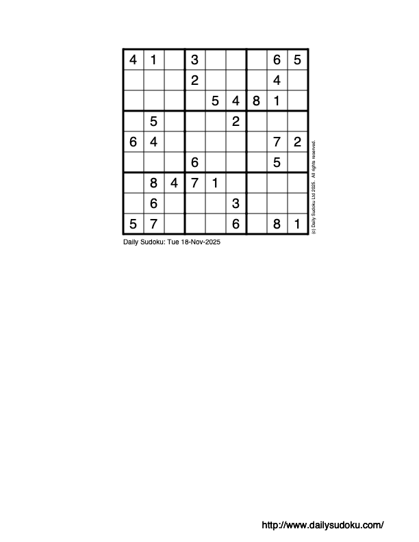

<style>
.grid-container {
    display: grid;
    grid-template-columns: 1fr 1fr; /* Creates two equal-width columns */
    gap: 20px; /* Space between columns */
}
</style>

# The Mercury Programming Language

## Melbourne Compose Talk November 2025

### David Overton

---

# What is Mercury?

* Logic/functional programming language
* Purely declarative
  - no side effects
  - referential transparency
* Strict (i.e. not lazy)
* Strong static type system
* Strong mode and determinism systems
* "Logic programming for the real world"


<!-- presenter notes

What is Mercury?
Mercury is a programming language that combines logic programming and functional programming.
It is a pure declarative language. That means there are no side-effects, and that it is referentially transparent.
It has a strong static type system - based on ML / Haskell Hindley-Milner system.


-->

<!-- ---
## Why Another Declarative Language?

* **Prolog:** expressive but dynamically typed and unpredictable
* **Haskell:** pure and safe but function-centric
* **Mercury:** bridges the gap — *logic + purity + performance*

<div data-marpit-fragment>

> Bringing Haskell-like rigor to the relational world of Prolog.

</div> -->

---

## A Bit of History

* Started in **1994** at the University of Melbourne
* Creators: **Zoltan Somogyi, Fergus Henderson, Thomas Conway, et al**
* Goal: industrial-strength logic programming
* Original compiler written in the intersection of Mercury and NU-Prolog until is could bootstrap itself
* Became a focus of PL / LP research at Melbourne, Monash and RMIT, as well as further afield (KU Leuven, Belgium; Uppsala, Sweden)
* Several commercial users
* No longer an active research project, but still under development by Zoltan and others

<!--
The Mercury project started at Melbourne Uni in 1994.
It came out of earlier work by Zoltan on typed logic programming, combined with Fergus's honours thesis on strong mode systems.
They were joined by another student Tom Conway who wrote the original code generator.
The goal of the project was to create a logic programming language that was suitable for industrial applications.
The Mercury compiler is written in Mercury. Until it could bootstrap they used the intersection between Mecury and NU-Prolog.
A decent size research group developed around the language, and Melbourne Uni as weill as Monash and RMIT, and even attracted 
interest from further afield, e.g. KU Leuven in Belgium and Uppsala in Sweden.
There was also interest from several commercial users, some of whom still use the language today.
These days, there is no longer an active research group based around Mercury, but it is still maintained by Zoltan and several others.
-->
---

# What is Logic Programming?

* Developed in the 1970s based on predicate logic
* Key features:
  * Clauses (facts and rules)
  * Logical connectives (and, or, not)
  * Unification
  * Backtracking for search

<!--
Ok, so what is logic programming?
It is programming based on predicate logic.
The first logic programming systems (forerunners of Prolog) were developed in the 1970s.
-->
---

## Prolog

```prolog
% facts
parent(alice, bob).
parent(alice, barb).
parent(bob, carol).
parent(bob, charlie).
parent(barb, chris).
parent(barb, cate).

% rule
grandparent(A, C) :-
  parent(A, B),
  parent(B, C).
```

<div data-marpit-fragment>

```prolog
% query
?- grandparent(alice, X).
  X = carol ; X = charlie ; X = chris ; X = cate.
```

<!--
rule: grandparent of A is B if there is a C such that parent of A is C and parent of C is B.
-->

</div>

--- 

## Predicate logic

```prolog
grandparent(A, C) :-
  parent(A, B),
  parent(B, C).
```

<marp-pre>

$$
\begin{align}
\forall A \forall C~ & \mathrm{grandparent}(A, C) \leftarrow \\
    &\exists B~\mathrm{parent}(A, B) \land \mathrm{parent}(B, C)
\end{align}
$$

</marp-pre>

* Implicit variable quantification
* `:-` is $\leftarrow$ (reverse implication or &lsquo;if&rsquo;)
* `,` is $\land$ (logical conjunction or &lsquo;and&rsquo;)

---

## Problems with Prolog

* Lack of static types, modes and determinism
  * No help from compiler to catch potential errors
  * Hard for compiler to generate efficient code
  * Negation can be unsound
  * Requires use of non-logical constructs (such as *cut*) for efficiency
* Impure features, e.g. I/O
  * Makes it harder to reason about code logically


---


# Mercury example

```mercury
:- pred append(list(T), list(T), list(T)).
:- mode append(in, in, out) is det.

append([], Ys, Ys).
append([X | Xs], Ys, [X | Zs]) :-
  append(Xs, Ys, Zs).
```

<div data-marpit-fragment>

compare Haskell code:
```haskell
append :: [a] -> [a] -> [a]
append [] ys = ys
append (x:xs) ys = x : append xs ys
```

</div>

* Relation, not a function, but otherwise similar in structure to Haskell equivalent
* Prolog syntax for variables (upper case), function symbols (lower case),
 and lists `[X | Xs]`

---

Can write as a single clause:

<div class="grid-container">
<div>

##### Mercury

```mercury
append(Xs, Ys, Zs) :-
  (
    Xs = [],
    Ys = Zs
  ;
    Xs = [X | Xs0],
    append(Xs0, Ys, Zs0),
    Zs = [X | Zs0]
  ).
```

</div>
<div>

##### Haskell

```haskell
append xs ys =
  case xs of
    []        -> ys
    (x : xs') ->
      x : append xs' ys
```

</div>
</div>

<div class="grid-container">
<div>

* Comma for conjunction (**and**)
* Semicolon for disjunction (**or**)
* Unification (`=`) for pattern matching

</div>
<div>

* Disjuncts are non-overlapping because `Xs` unifies with two different list constructors
</div>

</div>

---

**Aside:** Mercury also has functions so we could write `append` as a function:
```mercury
:- func append(list(T), list(T)) = list(T).

append([], Ys) = Ys.
append([X | Xs], Ys) = [X | append(Xs, Ys)].
```
compare Haskell code:
```haskell
append :: [a] -> [a] -> [a]
append [] ys = ys
append (x:xs) ys = x : append xs ys
```
but ...

---

... `append` as a predicate can have other *modes*:

```mercury
:- pred append(list(T), list(T), list(T)).
:- mode append(in, in, out) is det.
:- mode append(in, in, in) is semidet.
:- mode append(in, out, in) is semidet.
:- mode append(out, out, in) is multi.

append([], Ys, Ys).
append([X | Xs], Ys, [X | Zs]) :-
  append(Xs, Ys, Zs).
```
---

```mercury
?- append(Xs, Ys, [1, 2, 3]).
```
multiple solutions:
```mercury
  Xs = [],        Ys = [1, 2, 3]
; Xs = [1],       Ys = [2, 3]
; Xs = [1, 2],    Ys = [3]
; Xs = [1, 2, 3], Ys = []
```
(uses mode `append(out, out, in)`)
Solution space explored through depth-first search and backtracking.

---

## Another example

```mercury
:- pred member(T, list(T)).
:- mode member(in, in) is semidet.
:- mode member(out, in) is nondet.

member(X, [X | _]).
member(X, [_ | Xs]) :-
    member(X, Xs).
```

<div class="grid-container">

<div data-marpit-fragment>

Existential quantification:
 ```mercury
 ?- some [X] (
      member(X, [1, 2, 3]),
      X > 1).
 true.
 ```
 </div>

<div data-marpit-fragment>

Universal quantification:
 ```mercury
?- all [X] (
    member(X, [1, 2, 3]) =>
      X > 1).
fail.
 ```
 </div>

 </div>

---

# Types

Features of the Mercury type system:

<div class="grid-container">
<div>

 - strong static type system
 - algebraic data types
 - subtypes
 - type inference (with ad-hoc overloading)
 - higher order types
 </div>
 <div>

 - record types with named fields
 - type classes
 - existential types
 - runtime type information (reflection)
 - no higher-kinded types :cry:
 </div>
 </div>

---
## Example type definitions

<table>
<tr><th/><th>Mercury</th><th>Haskell</th></tr>
<tr data-marpit-fragment>
<th>enum</th>
<td>

```mercury
:- type bool ---> yes ; no.
```

</td>
<td>

```haskell
data Bool = True | False   
```

</td>
</tr>
<tr data-marpit-fragment>
<th>polymorphic type</th>
<td>

```mercury
:- type maybe(T)
        ---> yes(T)
        ;    no.          
```

</td>
<td>

```haskell
data Maybe a
      = Just a
      | Nothing           
```
</td>
</tr>

<tr data-marpit-fragment>
<th>type alias</th>
<td>

```mercury
:- type width == float.    
```
</td>
<td>

```haskell
type Width = Double        
```
</td>
</tr>
<tr data-marpit-fragment>
<th>newtype</th>
<td>

```mercury
:- type counter
        ---> counter(int).
```
</td>

<td>

```haskell
newtype Counter
        = Counter Int      
```
</td>
</table>

---

## Higher order types

```mercury
:- pred map(pred(T, U), list(T), list(U)).
:- mode map(pred(in, out) is det, in, out) is det.

map(_, [], []).
map(P, [X | Xs], [Y | Ys]) :-
  P(X, Y),
  map(P, Xs, Ys).
```

<div data-marpit-fragment>

Currying
```mercury
:- pred add(int, int, int).
:- mode add(in, in, out) is det.

?- map(add(1), [1, 2, 3], Ys).
Ys = [2, 3, 4]
```

</div>

---

# Modes

* Describe data flow through _instantiation states_ of variables

<div data-marpit-fragment>

```mercury
:- mode in == ground >> ground.
:- mode out == free >> ground.
:- mode unused == free >> free.
```

</div>

* Mode declarations for a predicate must give a mode for each argument:

<div data-marpit-fragment>

```mercury
:- mode append(in, in, out).
```

</div>

* Functions have a default mode where arguments have mode `in` and the function result has mode `out`, unless otherwise specified.

---

# Determinism

Each mode of a predicate or function is categorised by whether or not it can fail and how many solutions it can produce:

* `det`: exactly one solution
* `semidet`: at most one solution (can fail or succeed once)
* `multi`: at least one solution
* `nondet`: zero or more solutions
* `failure`: no solutions (always fails)
* `erroneous`: never returns (infinite loop, exception or runtime error)

---

| max solutions | 0         | 1          | >1      |
| ------------- | --------- | ---------- | ------- |
| cannot fail   | `erroneous` | `det` | `multi` |
| can fail      | `failure` | `semidet` | `nondet` |

---

# I/O and unique modes

- Mercury is a *pure*  declarative language, so how do we do I/O?
* Thread a &ldquo;state of the world&rdquo; through predicates that do I/O

<div data-marpit-fragment>

```mercury
:- pred write_string(string, io, io).
```

</div>

* But we want to make sure an `io` state is never re-used, even when backtracking.

<div data-marpit-fragment>

```mercury
:- mode write_string(in, di, uo) is det.
```

</div>

* `di`: destructive input
* `uo`: unique output

---
## Unique modes
```mercury
:- mode di == unique >> clobbered.
:- mode uo == free >> unique.
```
* `unique`: a unique reference to this value
* `clobbered`: no references to the value (it may have been destroyed or destructively updated)
* The compiler ensures that the `di` argument is a unique reference and is never used again after the call.
* Requires that calls doing I/O can't fail and can't be retried via backtracking.

---
## I/O example
```mercury
:- pred main(io::di, io::uo) is det.

main(IO0, IO) :-
  io.write_string("What is your name?\n", IO0, IO1),
  io.read_line_as_string(Result, IO1, IO2),
  (
    Result = ok(String),
    io.format("Hello %s, nice to meet you!\n", [s(strip(String))], IO2, IO3),
    main(IO3, IO)
  ;
    Result = eof,
    io.write_string("Ok, bye!\n", IO2, IO)
  ;
    Result = error(Err),
    io.write_string("Error: ", IO2, IO3),
    io.print(Err, IO3, IO)
  ).
```
---

## State variables

* Threading those numbered `IOn` variables through the code can get tedious very fast.
* Haskell uses a state monad to hide the I/O state.
* Mercury has a difference solution: *state variables*.

---

## State variables

```mercury
:- pred main(io::di, io::uo) is det.

main(!IO) :-
  io.write_string("What is your name?\n", !IO),
  io.read_line_as_string(Result, !IO),
  (
    Result = ok(String),
    io.format("Hello %s, nice to meet you!\n", [s(strip(String))], !IO),
    main(!IO)
  ;
    Result = eof,
    io.write_string("Ok, bye!\n", !IO)
  ;
    Result = error(Err),
    io.write_string("Error: ", !IO),
    io.print(Err, !IO)
  ).

```
---

# Module system

* Modules have `interface` and `implementation` sections.
* Only things declared in the `interface` section are exported.
* There are also submodules, either nested or in separate files.

---
## Module example

```mercury
:- module hello.
:- interface.
:- import_module io.

:- pred main(io::di, io::uo) is det.

:- implementation.

:- import_module list, string.

main(!IO) :-
  ...
```

---

## Abstract types

- A type declared in the module interface, but defined in the implementation is an *abstract type*

```mercury
:- module set.
:- interface.

:- type set(T).

:- implementation.

:- type set(T)
  --->  set(list(T)).
```

---

# Tooling
* `mmc`: Melbourne Mercury Compiler
  - Backends targetting C, Java and C#
  - C backend uses Boehm GC
* `mdb`: Mercury debugger
  - supports `retry`, which is awesome.
* `mprof`: time and memory profiler
* standard library: lots of useful data structures

---

# Who uses Mercury?

* Academic research projects, such as
  * HAL constraint logic programming language (Melbourne/Monash Uni)
  * G12 constraint programming platform (NICTA)
* Mission Critical IT &mdash; ODASE ontology platform
* Opturion &mdash; optimisation platform (commercial spin-off from G12)
* YesLogic &mdash; Prince HTML+CSS to PDF typesetting software

---

# Example program: Sudoku


